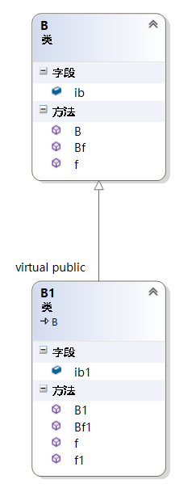
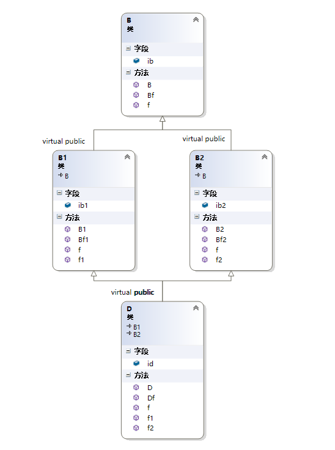
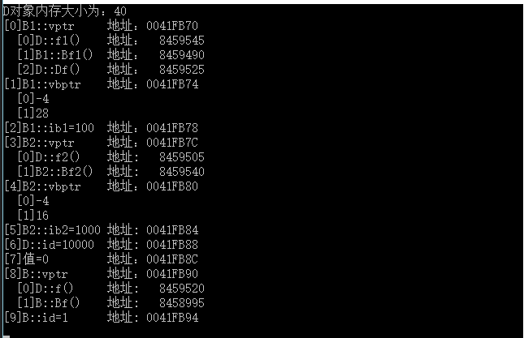

虚继承解决了菱形继承中最派生类拥有多个间接父类实例的情况。虚继承的派生类的内存布局与普通继承很多不同，主要体现在：

- 虚继承的子类，如果本身定义了新的虚函数，则编译器为其生成一个虚函数指针（vptr）以及一张虚函数表。该vptr位于对象内存最前面。
   - vs非虚继承：直接扩展父类虚函数表。
- 虚继承的子类也单独保留了父类的vprt与虚函数表。这部分内容接与子类内容以一个四字节的0来分界。
- 虚继承的子类对象中，含有四字节的虚表指针偏移值。

为了分析最后的菱形继承，我们还是先从单虚继承继承开始。

# 1 虚基类表解析
在C++对象模型中，虚继承而来的子类会生成一个隐藏的虚基类指针（vbptr），在Microsoft Visual C++中，**虚基类表指针总是在虚函数表指针之后**，因而，对某个类实例来说，如果它有虚基类指针，那么虚基类指针可能在实例的0字节偏移处（该类没有vptr时，vbptr就处于类实例内存布局的最前面，否则vptr处于类实例内存布局的最前面），也可能在类实例的4字节偏移处。
一个类的虚基类指针指向的虚基类表，与虚函数表一样，虚基类表也由多个条目组成，条目中存放的是**偏移值**。第一个条目存放虚基类表指针（vbptr）所在地址到该类内存首地址的偏移值，由第一段的分析我们知道，这个偏移值为0（类没有vptr）或者-4（类有虚函数，此时有vptr）。我们通过一张图来更好地理解。

# 2 简单虚继承
如果我们的B1类虚继承于B类：
```cpp
//类的内容与前面相同
class B{...}
class B1 : virtual public B
```

```cpp
int main()
{
	B1 a;
    cout <<"B1对象内存大小为："<< sizeof(a) << endl;
 
    //取得B1的虚函数表
    cout << "[0]B1::vptr";
    cout << "\t地址：" << (int *)(&a)<< endl;
 
    //输出虚表B1::vptr中的函数
    for (int i = 0; i<2;++ i)
    {
        cout << "  [" << i << "]";
        Fun fun1 = (Fun)*((int *)*(int *)(&a) + i);
        fun1();
        cout << "\t地址：\t" << *((int *)*(int *)(&a) + i) << endl;
    }
 
    //[1]
    cout << "[1]vbptr "  ;
    cout<<"\t地址：" << (int *)(&a) + 1<<endl;  //虚表指针的地址
    //输出虚基类指针条目所指的内容
    for (int i = 0; i < 2; i++)
    {
        cout << "  [" << i << "]";
 
        cout << *(int *)((int *)*((int *)(&a) + 1) + i);
 
        cout << endl;
    }
 
 
    //[2]
    cout << "[2]B1::ib1=" << *(int*)((int *)(&a) + 2);
    cout << "\t地址：" << (int *)(&a) + 2;
    cout << endl;
 
    //[3]
    cout << "[3]值=" << *(int*)((int *)(&a) + 3);
    cout << "\t\t地址：" << (int *)(&a) + 3;
    cout << endl;
 
    //[4]
    cout << "[4]B::vptr";
    cout << "\t地址：" << (int *)(&a) +3<< endl;
 
    //输出B::vptr中的虚函数
    for (int i = 0; i<2; ++i)
    {
        cout << "  [" << i << "]";
        Fun fun1 = (Fun)*((int *)*((int *)(&a) + 4) + i);
        fun1();
        cout << "\t地址:\t" << *((int *)*((int *)(&a) + 4) + i) << endl;
    }
 
    //[5]
    cout << "[5]B::ib=" << *(int*)((int *)(&a) + 5);
    cout << "\t地址: " << (int *)(&a) + 5;
    cout << endl;
```
运行结果：
> 第二、第三...个条目依次为该类的最左虚继承父类、次左虚继承父类...的内存地址相对于虚基类表指针的偏移值。

在我们的例子中，也就是B类实例内存地址相对于vbptr的偏移值，也即是：[4]-[1]的偏移值，结果即为12，从地址上也可以计算出来：007CFDFC-007CFDF4结果的十进制数正是12。现在，我们对虚基类表的构成应该有了一个更好的理解。

# 3 虚拟菱形继承
如果我们有如下继承层次：
```cpp
class B{...}
class B1: virtual public  B{...}
class B2: virtual public  B{...}
class D : public B1,public B2{...}
```
类图如下所示：

- 在D类对象内存中，基类出现的顺序是：先是B1（最左父类），然后是B2（次左父类），最后是B（虚祖父类）
- D类对象的数据成员id放在B类前面，两部分数据依旧以0来分隔。
- 编译器没有为D类生成一个它自己的vptr，而是覆盖并扩展了最左父类的虚基类表，与简单继承的对象模型相同。
- 超类B的内容放到了D类对象内存布局的最后。

菱形虚拟继承下的C++对象模型为：
```cpp
int main()
{
    D d;
    cout << "D对象内存大小为：" << sizeof(d) << endl;
 
    //取得B1的虚函数表
    cout << "[0]B1::vptr";
    cout << "\t地址：" << (int *)(&d) << endl;
 
    //输出虚表B1::vptr中的函数
    for (int i = 0; i<3; ++i)
    {
        cout << "  [" << i << "]";
        Fun fun1 = (Fun)*((int *)*(int *)(&d) + i);
        fun1();
        cout << "\t地址：\t" << *((int *)*(int *)(&d) + i) << endl;
    }
 
    //[1]
    cout << "[1]B1::vbptr ";
    cout << "\t地址：" << (int *)(&d) + 1 << endl;  //虚表指针的地址
    //输出虚基类指针条目所指的内容
    for (int i = 0; i < 2; i++)
    {
        cout << "  [" << i << "]";
 
        cout << *(int *)((int *)*((int *)(&d) + 1) + i);
 
        cout << endl;
    }
 
 
    //[2]
    cout << "[2]B1::ib1=" << *(int*)((int *)(&d) + 2);
    cout << "\t地址：" << (int *)(&d) + 2;
    cout << endl;
 
    //[3]
    cout << "[3]B2::vptr";
    cout << "\t地址：" << (int *)(&d) + 3 << endl;
 
    //输出B2::vptr中的虚函数
    for (int i = 0; i<2; ++i)
    {
        cout << "  [" << i << "]";
        Fun fun1 = (Fun)*((int *)*((int *)(&d) + 3) + i);
        fun1();
        cout << "\t地址:\t" << *((int *)*((int *)(&d) + 3) + i) << endl;
    }
 
    //[4]
    cout << "[4]B2::vbptr ";
    cout << "\t地址：" << (int *)(&d) + 4 << endl;  //虚表指针的地址
    //输出虚基类指针条目所指的内容
    for (int i = 0; i < 2; i++)
    {
        cout << "  [" << i << "]";
 
        cout << *(int *)((int *)*((int *)(&d) + 4) + i);
 
        cout << endl;
    }
 
    //[5]
    cout << "[5]B2::ib2=" << *(int*)((int *)(&d) + 5);
    cout << "\t地址: " << (int *)(&d) + 5;
    cout << endl;
 
    //[6]
    cout << "[6]D::id=" << *(int*)((int *)(&d) + 6);
    cout << "\t地址: " << (int *)(&d) + 6;
    cout << endl;
 
    //[7]
    cout << "[7]值=" << *(int*)((int *)(&d) + 7);
    cout << "\t\t地址：" << (int *)(&d) + 7;
    cout << endl;
 
    //间接父类
    //[8]
    cout << "[8]B::vptr";
    cout << "\t地址：" << (int *)(&d) + 8 << endl;
 
    //输出B::vptr中的虚函数
    for (int i = 0; i<2; ++i)
    {
        cout << "  [" << i << "]";
        Fun fun1 = (Fun)*((int *)*((int *)(&d) + 8) + i);
        fun1();
        cout << "\t地址:\t" << *((int *)*((int *)(&d) + 8) + i) << endl;
    }
 
    //[9]
    cout << "[9]B::id=" << *(int*)((int *)(&d) + 9);
    cout << "\t地址: " << (int *)(&d) +9;
    cout << endl;
 
    getchar();
}
```
查看运行结果：

