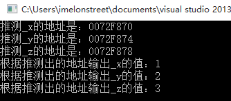

# 1 C++封装的布局成本
在C语言中，“数据”和“处理数据的操作（函数）”是分开来声明的，也就是说，语言本身并没有支持“数据和函数”之间的关联性。在C++中，我们通过类来将属性与操作绑定在一起，称为抽象数据结构。C语言中使用struct（结构体）来封装数据，使用函数来处理数据。举个例子，如果我们定义了一个struct Point3如下：
```c
typedef struct Point3
{
    float x;
    float y;
    float z;
} Point3;
```
为了打印这个Point3d，我们可以定义一个函数：
```c
void Point3d_print(const Point3d *pd)
{
    printf("(%f,%f,%f)",pd->x,pd->y,pd_z);
}
```

而在C++中，我们更倾向于定义一个Point3d类，以ADT来实现上面的操作:
```cpp
class Point3d
{
public:
	point3d (float x = 0.0,float y = 0.0,float z = 0.0)
            : _x(x), _y(y), _z(z){}
    float x() const {return _x;}
    float y() const {return _y;}
    float z() const {return _z;}
    inline ostream& operator<<(ostream &os, const Point3d &pt)
    {
        os<<"("<<pr.x()<<","<<pt.y()<<","<<pt.z()<<")";
    }
    
private:
    float _x;
    float _y;
    float _z;
};
```
看到这段代码，很多人第一个疑问可能是：加上了封装，布局成本增加了多少？答案是class Point3d并没有增加成本。学过了C++对象模型，我们知道，**Point3d类对象的内存中，只有三个数据成员**。上面的类声明中，三个数据成员直接内含在每一个Point3d对象中，而成员函数虽然在类中声明，却不出现在类对象（object）之中，这些函数(non-inline)属于类而不属于类对象，只会为类产生唯一的函数实例。所以，**Point3d的封装并没有带来任何空间或执行期的效率影响**。
而在下面这种情况下，C++的封装额外成本才会显示出来：

- 虚函数机制（virtual function） , 用以支持执行期绑定，实现多态。
- 虚基类 （virtual base class） ，虚继承关系产生虚基类，用于在多重继承下保证基类在子类中拥有唯一实例。


不仅如此，Point3d类数据成员的内存布局与c语言的结构体Point3d**成员内存布局是相同的**。C++中处在同一个访问标识符（指public、private、protected）下的声明的数据成员，在内存中必定保证以其声明顺序出现。而处于不同访问标识符声明下的成员则无此规定。对于Point3类来说，它的三个数据成员都处于private下，在内存中一起声明顺序出现。我们可以做下实验：
```cpp
void TestPoint3Member(const Point3d& p)
{
    cout << "推测_x的地址是：" << (float *) (&p) << endl;
    cout << "推测_y的地址是：" << (float *) (&p) + 1 << endl;
    cout << "推测_z的地址是：" << (float *) (&p) + 2 << endl;
 
    cout << "根据推测出的地址输出_x的值：" << *((float *)(&p)) << endl;
    cout << "根据推测出的地址输出_y的值：" << *((float *)(&p)+1) << endl;
    cout << "根据推测出的地址输出_z的值：" << *((float *)(&p)+2) << endl;
}

//测试代码
    Point3d a(1,2,3);
    TestPoint3Member(a);
```

运行结果：

# 2 空类的继承层次中每个类的大小
今有类如下：
```cpp
class B{};
class B1 :public virtual  B{};
class B2 :public virtual  B{};
class D : public B1, public B2{};
int main()
{
    B b;
    B1 b1;
    B2 b2;
    D d;
    cout << "sizeof(b)=" << sizeof(b)<<endl;
    cout << "sizeof(b1)=" << sizeof(b1) << endl;
    cout << "sizeof(b2)=" << sizeof(b2) << endl;
    cout << "sizeof(d)=" << sizeof(d) << endl;
    getchar();
}
```
输出结果是：

- **编译器为空类安插1字节的char，以使该类对象在内存得以配置一个地址**。
- b1虚继承于b，编译器为其安插一个4字节的虚基类表指针（32为机器），此时b1已不为空，编译器不再为其安插1字节的char（优化）。
- b2同理。
- d含有来自b1与b2两个父类的两个虚基类表指针。大小为8字节。
