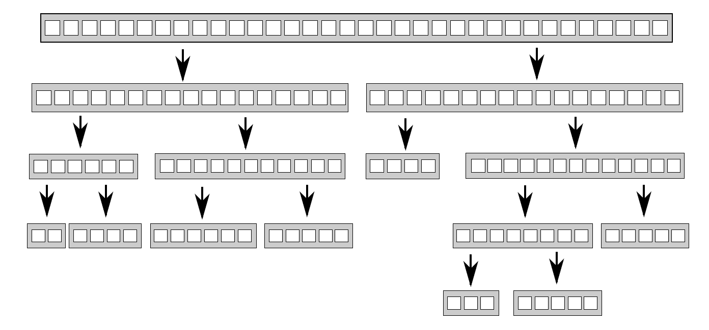

# 1 线程间task划分

## 1.1 对数据进行分组划分
最简单的分配方式：第一组N个元素分配一个线程，下一组N个元素再分配一个线程，以此类推，如下图所示。不管数据怎么分，每个线程都会对分配给它的元素进行操作，不过并不会和其他线程进行沟通，直到处理完成。执行线程独立的执行这些任务，**结果在会有主线程中合并**。


## 1.2 递归划分
递归划分数据如下图：

- 在递归的基础上进行任务的划分，只需要将一定数量的数据打包后，交给线程即可。`std::async()`可以处理这种简单的情况。
- 另一种选择是使用`std::thread::hardware_concurrency()`函数来确定线程的数量。然后，可以将已排序的数据推到线程安全的栈上。线程无所事事时，不是已经完成对自己数据块的梳理，就是在等待一组排序数据的产生；线程可以从栈上获取这组数据，并且对其排序。


代码示例：
```cpp
/*
使用std::thread::hardware_concurrency()函数来确定线程的数量。然后，可以将已排序的数据推到线程安全的栈上.
仅演示想法，而不是作为工业代码。如果使用C++ 17编译器，最好使用标准库提供的并行算法
*/
#include <list>
#include <vector>
#include <future>
#include <algorithm>
#include "19_threadsafe_stack.hpp"

template <typename T>
struct sorter // 1
{
    struct chunk_to_sort
    {
        std::list<T> data;
        std::promise<std::list<T>> promise;
    };

    threadsafe_stack<chunk_to_sort> chunks; // 2 使用线程安全栈保存data数据块
    std::vector<std::thread> threads;       // 3 保存线程
    unsigned const max_thread_count;        //最大支持的线程数，根据硬件获得
    std::atomic<bool> end_of_data;

    sorter() : max_thread_count(std::thread::hardware_concurrency() - 1),
               end_of_data(false)
    {
    }

    ~sorter() // 4
    {
        end_of_data = true; // 5

        for (unsigned i = 0; i < threads.size(); ++i)
        {
            threads[i].join(); // 6
        }
    }
    //从线程安全栈中获取一个数据块，进行排序
    void try_sort_chunk()
    {
        std::shared_ptr<chunk_to_sort> chunk = chunks.pop(); // 7
        if (chunk)
        {
            sort_chunk(chunk); // 8
        }
    }
    //排序的主函数
    std::list<T> do_sort(std::list<T> &chunk_data) // 9
    {
        if (chunk_data.empty())
        {
            return chunk_data;
        }

        std::list<T> result;
        result.splice(result.begin(), chunk_data, chunk_data.begin()); //转移数据到result列表中
        T const &partition_val = *result.begin();
        //10 对data进行第一次快速排序，根据data第一个元素排序，表达式true放左边，false放右边，返回值为中间分组点
        typename std::list<T>::iterator divide_point = std::partition(chunk_data.begin(),
                                                                      chunk_data.end(),
                                                                      [&](T const &val) { return val < partition_val; });

        chunk_to_sort new_lower_chunk; //定义新的data类型保存上面排序结果的左部分数据块
        new_lower_chunk.data.splice(new_lower_chunk.data.end(),
                                    chunk_data, chunk_data.begin(),
                                    divide_point);

        std::future<std::list<T>> new_lower = new_lower_chunk.promise.get_future();
        chunks.push(std::move(new_lower_chunk)); // 11 将上面的左部分数据块保存到线程安全栈中
        if (threads.size() < max_thread_count)   // 12
        {                                        //启动新线程处理左部分数据块的排序
            threads.push_back(std::thread(&sorter<T>::sort_thread, this));
        }

        std::list<T> new_higher(do_sort(chunk_data)); //在本线程继续处理右部分的排序

        result.splice(result.end(), new_higher);
        //等下期望值变为ready，即表示新线程的排序任务已经结束
        while (new_lower.wait_for(std::chrono::seconds(0)) != std::future_status::ready) // 13
        {
            try_sort_chunk(); // 14 如果没有结束，本线程等待，并尝试处理安全栈中数据
        }

        result.splice(result.begin(), new_lower.get());
        return result;
    }
    //对数据进行排序，并把结果保存在承诺值中
    void sort_chunk(std::shared_ptr<chunk_to_sort> const &chunk)
    {
        chunk->promise.set_value(do_sort(chunk->data)); // 15
    }

    void sort_thread()
    {
        while (!end_of_data) // 16
        {
            try_sort_chunk();          // 17
            std::this_thread::yield(); // 18
        }
    }
};

template <typename T>
std::list<T> parallel_quick_sort(std::list<T> input) // 19 并行快速排序函数
{
    if (input.empty())
    {
        return input;
    }
    sorter<T> s;

    return s.do_sort(input); // 20
}
```

## 1.3 基于任务类型划分
对分工的排序，也就是从并发分离关注结果；**每个线程都有不同的任务**，这意味着真正意义上的线程独立。其他线程偶尔会向特定线程交付数据，或是通过触发事件的方式来进行处理；不过总体而言，每个线程只需要关注自己所要做的事情即可。其本身就是良好的设计，**每一段代码只对自己的部分负责**。

多线程下有两个危险需要分离关注。第一个是对错误担忧的分离，主要表现为线程间共享着很多的数据，或者不同的线程要相互等待，这两种情况都是因为线程间很密切的交互。这种情况发生时，就需要看一下为什么需要这么多交互。当所有交互都有同样的问题，就应该使用单线程来解决，并将引用同一源的线程提取出来。或者当有两个线程需要频繁的交流，在没有其他线程时，就可以将这两个线程合为一个线程。当通过任务类型对线程间的任务进行划分时，不应该让线程处于完全隔离的状态。当多个输入数据集需要使用同样的操作序列，可以将序列中的操作分成多个阶段，来让每个线程执行。


# 2 并发性能的影响因素

## 2.1 乒乓缓存
当两个线程并发的在不同处理器上执行，并且对同一数据进行读取，通常不会出现问题；因为数据将会拷贝到每个线程的缓存中，并且让两个处理器同时进行处理。**乒乓缓存：**当有线程对数据进行修改的时候，这个修改需要更新到其他核芯的缓存中去，就要耗费一定的时间。根据线程的操作性质，以及使用到的内存序，这样的修改**可能会让第二个处理器停下来，等待硬件内存更新缓存中的数据**。当一个处理器因为等待缓存转移而停止运行时，这个处理器就不能做任何事情，所以对于整个应用来说这是一个坏消息。减少两个线程对同一个内存位置的竞争，能减轻乒乓缓存，但还是可能因为**伪共享**导致乒乓缓存。

## 2.2 伪共享
假设你有一个int类型的数组，并且有一组线程可以访问数组中的元素，且对数组的访问很频繁(包括更新)。通常int类型的大小要小于一个缓存行，同一个缓存行中可以存储多个数据项（**某个线程所要访问的数据过于接近另一线程的数据**）。因此，即使每个线程都能对数据中的成员进行访问，硬件缓存还是会产生乒乓缓存。每当线程访问0号数据项，并对其值进行更新时，缓存行的所有权就需要转移给执行该线程的处理器，这仅是为了更新1号数据项的线程获取1号线程的所有权。缓存行是共享的，因此使用**伪共享**来称呼这种方式。
解决办法就是对数据进行构造，**让同一线程访问的数据项存在临近的内存中**(就像是放在同一缓存行中)，这样那些能被独立线程访问的数据将分布在相距很远的地方，并且可能是存储在不同的缓存行中。C++17标准在头文件`<new>`中定义了`std::hardware_destructive_interference_size`它指定了当前编译目标可能共享的连续字节的最大数目。如果**确保数据间隔大于等于这个字节数，就不会有错误的共享存在了**。


# 3 三个标准函数的并行实现

## 3.1 并行实现std::for_each
`std::for_each`的原理很简单：其对某个范围中的元素，依次调用用户提供的函数。为了实现这个函数的并行版本，需要对每个线程上处理的元素进行划分。事先知道元素数量，所以可以处理前**对数据进行分组划分**。
```cpp
/*
使用std::async实现std::for_each
*/
#include <iterator>
#include <algorithm>
#include <future>

template <typename Iterator, typename Func>
void parallel_for_each(Iterator first, Iterator last, Func f)
{
    unsigned long const length = std::distance(first, last);

    if (!length)
        return;

    unsigned long const min_per_thread = 25;

    if (length < (2 * min_per_thread))
    {
        // 如果数据小于两个线程的能力，直接使用单线程for_each
        std::for_each(first, last, f);
    }
    else
    {
        Iterator const mid_point = first + length / 2;
        // 对数据分为两部分，异步执行一部分
        std::future<void> first_half = std::async(&parallel_for_each<Iterator, Func>, first, mid_point, f);
        parallel_for_each(mid_point, last, f); // 迭代执行另一部分
        first_half.get();                      // 通过future传播异常，后面可以跟异常处理
    }
}
```

## 3.2 并行实现std::find
当得到想要的答案就中断其他任务的执行，所以不能等待线程处理对剩下的元素进行处理。如果不中断其他线程，那么串行版本的性能可能会超越并行版，因为串行算法可以在找到匹配元素的时候，停止搜索并返回。
**中断其他线程的一个办法就是使用原子变量作为一个标识**，处理过每一个元素后就对这个标识进行检查。如果标识被设置，就有线程找到了匹配元素，所以算法就可以停止并返回了。缺点就是，加载原子变量是一个很慢的操作，会阻碍每个线程的运行。
```cpp
//使用std::async实现的并行find算法
#include <atomic>
#include <future>

template <typename Iterator, typename MatchType> // done为已经找到的标识
Iterator parallel_find_impl(Iterator first, Iterator last, MatchType match,
                            std::atomic<bool> &done)
{
    try
    {
        unsigned long const length = std::distance(first, last);
        unsigned long const min_per_thread = 25;
        if (length < (2 * min_per_thread)) // 如果数据不足以分成两部分，直接单线程查找
        {
            for (; (first != last) && !done.load(); ++first) // 4
            {
                if (*first == match)
                {
                    done = true; // 如果找到，将done置为true，这样其他线程在进入for循环时判断done为true会直接返回
                    return first;
                }
            }
            return last; // 6
        }
        else
        {
            Iterator const mid_point = first + (length / 2); // 7数据分成两部分
            // 异步查找第一部分，同时继续传递原子bool done
            std::future<Iterator> async_result = std::async(&parallel_find_impl<Iterator, MatchType>,
                                                            mid_point, last, match, std::ref(done));
            // 迭代执行另一部分
            Iterator const direct_result = parallel_find_impl(first, mid_point, match, done);
            // 返回结果，direct_result == mid_point，意味着结果在第一部分中，返回future期望值结果
            return (direct_result == mid_point) ? async_result.get() : direct_result;
        }
    }
    catch (...)
    {
        done = true; // 11
        throw;
    }
}

template <typename Iterator, typename MatchType>
Iterator parallel_find(Iterator first, Iterator last, MatchType match)
{
    std::atomic<bool> done(false);                       // 原子bool类型，用于标识已经找到
    return parallel_find_impl(first, last, match, done); // 12
}
```
