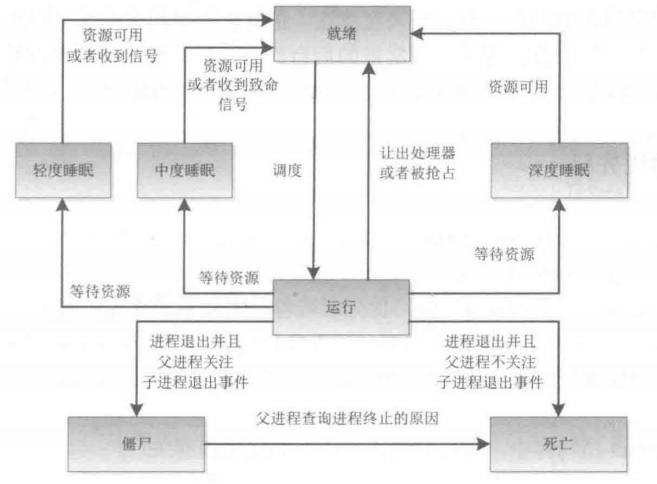
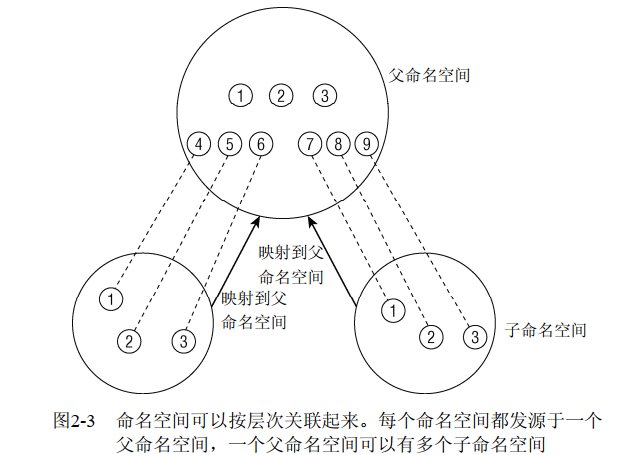
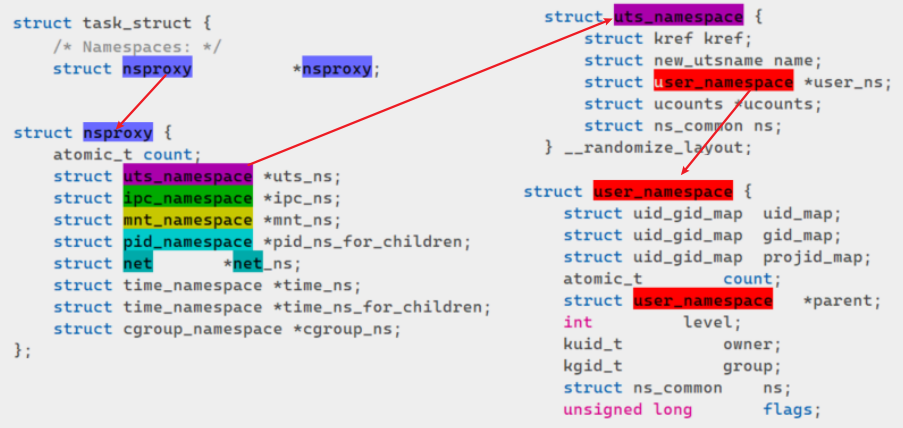
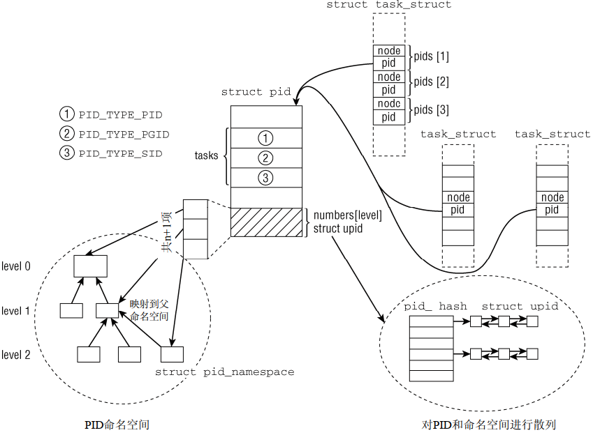
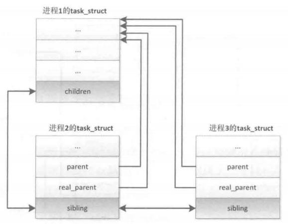
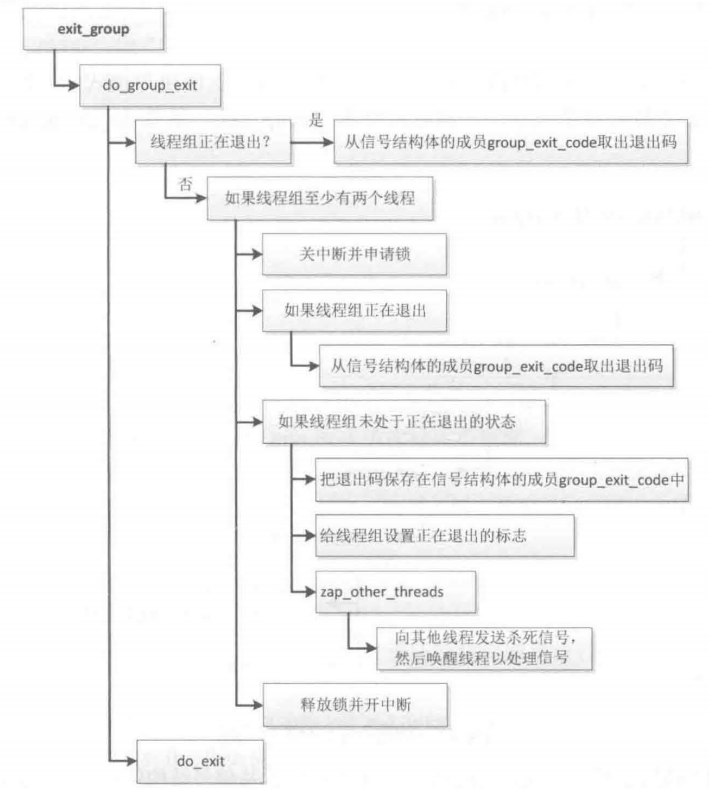
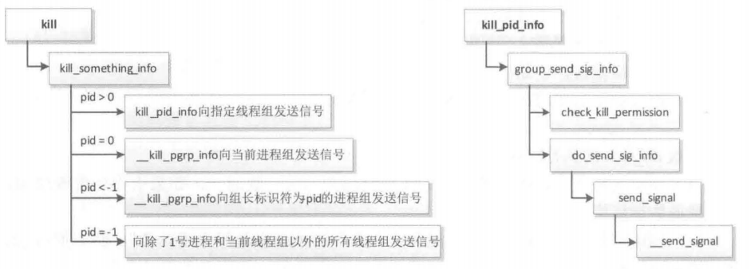

# 什么是进程
进程和线程是程序运行时状态，是动态变化的，进程和线程的管理操作(比如，创建，销毁等)都是有内核来实现的。Linux中的进程于Windows相比是很轻量级的，而且不严格区分进程和线程，_线程不过是一种特殊的进程_。
所以下面只讨论进程，只有当线程与进程存在不一样的地方时才提一下线程。

- 进程提供2种虚拟机制：**虚拟处理器和虚拟内存**
- 每个进程有独立的虚拟处理器和虚拟内存
- 每个线程有独立的虚拟处理器，同一个进程内的线程有可能会共享虚拟内存。

Linux中可以用ps命令查看所有进程的信息：`ps -eo pid，tid，ppid，comm`

## 进程优先级
比较粗糙的划分，进程可以分为**实时进程**和**非实时进程**。

- **硬实时进程**：Linux不支持硬实时处理，至少在主流的内核中不支持
- **软实时进程**：硬实时进程的一种弱化形式，
- **普通进程**：没有时间约束，但可以按照_重要性_划分优先级

## 进程生命周期

- 运行：该进程此刻正在执行。
- 等待：进程能够运行，但没有得到许可，因为CPU分配给另一个进程。调度器可以在下一次任务切换时选择该进程。
- 睡眠：进程正在睡眠无法运行，因为它在等待一个外部事件。调度器无法在下一次任务切换时选择该进程。



# 进程表示
内核中进程的信息主要保存在**task_struct中(include/linux/sched.h)，**进程标识PID和线程标识TID对于同一个进程或线程来说都是相等的。

## 进程limits
进程各项资源的限制记录在`task_struct.signal->rlim`中，`struct rlimit rlim`用index区分不同的资源类型，对每种资源设定了如下两个限制：
```c
struct rlimit {
    __kernel_ulong_t    rlim_cur;//当前限制，可以通过系统调用setrlimit修改
    __kernel_ulong_t    rlim_max;//最大硬限制，不能修改，除非重新编译内核
};
```
不同index代表不同的资源（`cat /proc/self/limits`可以列出本进程的rlim值）：

| **宏定义** | **含义** |
| --- | --- |
| RLIMIT_CPU | 按毫秒计算的最大CPU时间 |
| RLIMIT_FSIZE | 允许的最大文件长度 |
| RLIMIT_DATA | 数据段的最大长度 |
| RLIMIT_STACK | （用户状态）栈的最大长度 |
| RLIMIT_CORE | 内存转储文件的最大长度 |
| RLIMIT_RSS | 常驻内存的最大尺寸。换句话说，进程使用页帧的最大数目。目前未使用 |
| RLIMIT_NPROC | 与进程真正UID关联的用户可以拥有的进程的最大数目 |
| RLIMIT_NOFILE | 打开文件的最大数目 |
| RLIMIT_MEMLOCK | 不可换出页的最大数目 |
| RLIMIT_AS | 进程占用的虚拟地址空间的最大尺寸 |
| RLIMIT_LOCKS | 文件锁的最大数目 |
| RLIMIT_SIGPENDING | 待决信号的最大数目 |
| RLIMIT_MSGQUEUE | 信息队列的最大数目 |
| RLIMIT_NICE | 非实时进程的优先级（ |
| RLIMIT_RTPRIO | 最大的实时优先级 |


## 命名空间
命名空间建立了系统的不同视图，全局资源都通过命名空间抽象起来，每一项全局资源都必须包装到容器数据结构中，只有资源和包含资源的命名空间构成的二元组仍然是全局唯一的。这使得可以**将一组进程放置到容器中，各个容器彼此隔离**。

| **命名空间** | **隔离资源** |
| --- | --- |
| UNlX分时系统(UNIX Timesharing System,UTS) | 主机名和网络信息服务(NlS)域名 |
| 进程间通信(IPC) | UNIX系统5进程间通信和POSIX消息队列 |
| 挂载(mount) | 挂载点 |
| 进程号(PID) | 进程号 |
| 网络(network) | 网络协议栈 |
| 控制组(cgroup) | 控制组根目录 |
| 用户(user) | 用户标识符和组标识符 |



1. 在用fork或clone系统调用创建新进程时，有**特定的选项**可以控制是与父进程共享命名空间，还是建立新的命名空间。
```c
#define CLONE_NEWUTS        0x04000000  /* New utsname namespace */
#define CLONE_NEWIPC        0x08000000  /* New ipc namespace */
#define CLONE_NEWUSER       0x10000000  /* New user namespace */
#define CLONE_NEWPID        0x20000000  /* New pid namespace */
#define CLONE_NEWNET        0x40000000  /* New network namespace */
```

2. **unshare系统调用**将进程的某些部分从父进程分离，其中也包括命名空间 


## 进程ID

- 全局ID是在内核本身和初始命名空间中的唯一ID号，在系统启动期间开始的init进程即属于初始命名空间。对每个ID类型，都有一个给定的全局ID，保证在整个系统中是唯一的。
- 局部ID属于某个特定的命名空间，不具备全局有效性。对每个ID类型，它们在所属的命名空间内部有效，但类型相同、值也相同的ID可能出现在不同的命名空间中 

对应在`task_struct`中为：
```c
struct task_struct {
...
	pid_t pid;//全局进程号
	pid_t tgid;//局部进程号
...
    struct hlist_node pid_links[PIDTYPE_MAX];//其他标识符的链表
}
```
 全局ID是唯一的，比较好理解；而局部ID会复杂一些。下图展示了命名空间下pid的结构：


```c
struct task_struct {
...
	struct list_head children; /* 子进程链表 */
	struct list_head sibling; /* 连接到父进程的子进程链表 */
...
}
```


# 进程的启动

## 创建进程
`fork`、`vfork`和`clone`三个系统调用都是调用`kernel_clone`函数进行进程或线程的创建：

```mermaid
graph LR
A(kernel_clone) -->B(copy_process)
    A --> C(get_task_pid)
    A --> D(初始化vfor的完成处理程序和ptrace标志)
    A --> E(wake_up_new_task)
    A --> F{是否设置了CLONE_VFORK}


B --> H(检查flags)
B --> I(dup_task_struct)
B --> J(检查资源限制)
B --> K(初始化task_struct)
B --> L(sched_fork设置调度器相关的参数)
B --> M(复制共享进程的各个部分)
B --> N(设置各个ID/进程关系等)

E --> trun(state = TASK_RUNNING)
E --> scpu(选择负载最轻的处理器)
E --> act(activate_task)

F --> |yes| G(wait_for_vfork_done)

L --> rt(实时调度类rt_sched_class)
L --> fair(公平调度类fair_sched_class)

M --> cs(copy_semundo system V信号量)
M --> cf(copy_files打开文件表)
M --> cfs(copy_fs共享文件系统信息)
M --> csi(copy_sighand)
M --> csig(copy_signal)
M --> cm(copy_mm共享虚拟内存)
M --> cn(copy_namespaces)
M --> cio(copy_io1/0 上下文)
M --> ct(copy_thread)
```


**创建线程和进程的步骤一样，只是最终传给clone()函数的参数不同。**比如，

- 通过一个普通的fork来创建进程，相当于：`clone(SIGCHLD， 0)`
- 创建一个线程(即一个和父进程共享地址空间，文件系统资源，文件描述符和信号处理程序的进程）：
   - `clone(CLONE_VM | CLONE_FS | CLONE_FILES | CLONE_SIGHAND， 0)`

在内核中创建的内核线程与普通的进程之间还有个主要区别在于：**内核线程没有独立的地址空间，它们只能在内核空间运行**。这与之前提到的Linux内核是个单内核有关。

## exec装载程序
exec: 读取可执行文件，将其载入到内存中运行，代替当前进程。exec不是一个系统调用，是多个系统调用的统称，最后都调用函数`do_execveat_common`：

```mermaid
graph LR
a(do_execveat_common)-->b(alloc_bprm)
a-->c(bprm_execve)

b-->f(bprm_mm_init分配临时的用户栈)

f-->g(mm_alloc)
f-->h(__bprm_mm_init各项参数压到用户栈)

c-->d(do_open_execat打开可执行文件)
c-->e(sched_exec选择负载最轻的处理器)
c-->i(exec_binprm)

i-->j(search_binary_handler)
```


# 进程的终止
进程退出分两种情况：进程主动退出(exit)和终止进程(kill)。 和创建进程一样，终结一个进程同样有很多步骤：

## 线程组exit


- 设置task_struct中的标识成员设置为PF_EXITING
- 调用del_timer_sync()删除内核定时器， 确保没有定时器在排队和运行
- 调用exit_mm()释放进程占用的mm_struct
- 调用sem__exit()，使进程离开等待IPC信号的队列
- 调用exit_files()和exit_fs()，释放进程占用的文件描述符和文件系统资源
- 把task_struct的exit_code设置为进程的返回值
- 调用exit_notify()向父进程发送信号，并把自己的状态设为EXIT_ZOMBIE
- 切换到新进程继续执行


子进程进入EXIT_ZOMBIE之后，虽然永远不会被调度，关联的资源也释放掉了，但是它本身占用的内存还没有释放，比如创建时分配的内核栈，task_struct结构等。**这些由父进程来释放**。


## 父进程release_task

- 父进程收到子进程发送的**exit_notify()**信号后，将该子进程的进程描述符和所有进程独享的资源全部删除。
- 如果子进程的父进程已经退出了，那么子进程在退出时，exit_notify()函数会先调用**forget_original_parent()，然后再调用find_new_reaper()来寻找新的父进程**。
   - find_new_reaper()函数先在当前线程组中找一个线程作为父亲，如果找不到，就让init做父进程。(init进程是在linux启动时就一直存在的)

## 系统调用kill
kill负责发送信号，具体处理右信号处理函数负责：

