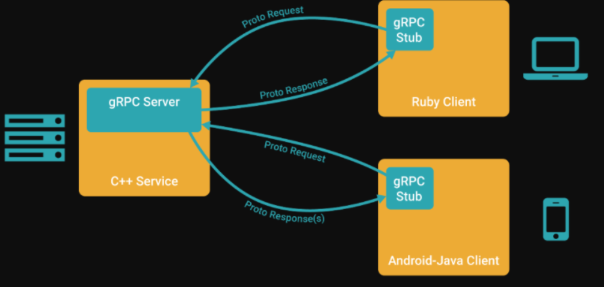

通过gRPC，客户端应用可以像调用本地对象一样直接调用另一台不同的机器上服务端应用的方法，使得您能够更容易地创建分布式应用和服务。与许多RPC系统类似，gRPC也是基于以下理念：定义一个服务，指定其能够被远程调用的方法（包含参数和返回类型）。在服务端实现这个接口，并运行一个gRPC服务器来处理客户端调用。在客户端拥有一个存根能够像服务端一样的方法。



# 参考教程：
[https://grpc.io/docs/languages/cpp/quickstart/](https://grpc.io/docs/languages/cpp/quickstart/)

# 安装gRPC
> 注意：windows平台要使用MSVC编译，MinGW实测编译失败（缺少Linux系统调用）

安装依赖
```shell
sudo apt install -y build-essential autoconf libtool pkg-config
```
下载grpc源码(国内镜像)
```shell
git clone -b v1.43.0 https://gitee.com/mirrors/grpc-framework grpc
```
修改更新submodule(GitHub的submodule下载很慢很慢, 一天都下不下来)
```shell
cd grpc
cat .gitmodules // 查看文件里的submodule, 将GitHub改成Gitee
git submodule update --init
```
安装gRPC
```shell
mkdir build
cd build
cmake -DCMAKE_INSTALL_PREFIX=/usr/local ..
make -j2
sudo make install
```
# 使用示例
```
|--- protos
|   |--- helloworld.proto -------定义文件，生成.cc或者.h文件
|--- server_cpp
|--- client.cpp
|--- CMakeLists.txt
```


## helloworld.proto
```cpp
syntax = "proto3";

option java_package = "ex.grpc";

package helloworld;

message Reply {
    int32 result = 1;
}

message HelloMessage {
    int32 a = 1;
    int32 b = 2;
}

service TestServer {
    rpc hello_request (HelloMessage) returns (Reply) {}
}
```


编译命令,自动生成grpc.pb和pb的cc和h文件(**CMakeLists.txt中集成如下命令，不需要单独编译）**:
```shell
protoc --cpp_out=. helloworld.proto
protoc --grpc_out=. --plugin=protoc-gen-grpc=`which grpc_cpp_plugin` helloworld.proto
```
## client
```cpp
#include <iostream>
#include <memory>
#include <string>
#include <grpcpp/grpcpp.h>
#include "helloworld.grpc.pb.h"

using grpc::Channel;
using grpc::ClientContext;
using grpc::Status;
using helloworld::TestServer;
using helloworld::HelloMessage;
using helloworld::Reply;

class GreeterClient {
    public:
        GreeterClient(std::shared_ptr<Channel> channel):stub_(TestServer::NewStub(channel)) {}
        int say_hello(const std::string& user) 
        {
            HelloMessage request;
            Reply reply;
            ClientContext context;
						//传入两个值，让server计算乘积
            request.set_a(21);
            request.set_b(22);

            Status status = stub_->hello_request(&context, request, &reply);
            if (status.ok()) {
                return reply.result();
            } else {
                std::cout << status.error_code() << ": " << status.error_message() << std::endl;
                return 0;
            }
        }

    private:
        std::unique_ptr<TestServer::Stub> stub_;
};

int main(int argc, char** argv) 
{
    GreeterClient greeter(grpc::CreateChannel("127.0.0.1:5000", grpc::InsecureChannelCredentials()));
    std::string user("world");
    int reply = greeter.say_hello(user);
    std::cout << "Greeter received: " << reply << std::endl;
    return 0;
}
```
## server
```cpp
#include <string>
#include <grpcpp/grpcpp.h>
#include "helloworld.grpc.pb.h"

using grpc::Server;
using grpc::ServerBuilder;
using grpc::ServerContext;
using grpc::Status;
using helloworld::TestServer;
using helloworld::HelloMessage;
using helloworld::Reply;

class HelloServiceImplementation final : public TestServer::Service {
    Status hello_request(ServerContext* context, const HelloMessage* request, Reply* reply) override
    {
        int a = request->a();
        int b = request->b();
        reply->set_result(a * b);//返回乘积
        return Status::OK;
    }
};

int main(int argc, char** argv) {
    std::string address("0.0.0.0:5000");
    HelloServiceImplementation service;
    ServerBuilder builder;
    builder.AddListeningPort(address, grpc::InsecureServerCredentials());
    builder.RegisterService(&service);
    std::unique_ptr<Server> server(builder.BuildAndStart());
    std::cout << "Server listening on port: " << address << std::endl;
    server->Wait();
    return 0;
}
```
## CMakeLists
```cpp
cmake_minimum_required(VERSION 3.14)

project(grpcdemo)

set(CMAKE_CXX_STANDARD 14)

set(protobuf_MODULE_COMPATIBLE TRUE)
find_package(Protobuf CONFIG REQUIRED)
message(STATUS "Using protobuf ${Protobuf_VERSION}")

set(_PROTOBUF_LIBPROTOBUF protobuf::libprotobuf)
set(_REFLECTION gRPC::grpc++_reflection)
if(CMAKE_CROSSCOMPILING)
    find_program(_PROTOBUF_PROTOC protoc)
else()
    set(_PROTOBUF_PROTOC $<TARGET_FILE:protobuf::protoc>)
endif()

# Find gRPC installation
# Looks for gRPCConfig.cmake file installed by gRPC's cmake installation.
find_package(gRPC CONFIG REQUIRED)
message(STATUS "Using gRPC ${gRPC_VERSION}")

set(_GRPC_GRPCPP gRPC::grpc++)
if(CMAKE_CROSSCOMPILING)
    find_program(_GRPC_CPP_PLUGIN_EXECUTABLE grpc_cpp_plugin)
else()
    set(_GRPC_CPP_PLUGIN_EXECUTABLE $<TARGET_FILE:gRPC::grpc_cpp_plugin>)
endif()

# Proto file
get_filename_component(hw_proto "protos/helloworld.proto" ABSOLUTE)
get_filename_component(hw_proto_path "${hw_proto}" PATH)

# Generated sources
set(hw_proto_srcs "${CMAKE_CURRENT_BINARY_DIR}/helloworld.pb.cc")
set(hw_proto_hdrs "${CMAKE_CURRENT_BINARY_DIR}/helloworld.pb.h")
set(hw_grpc_srcs "${CMAKE_CURRENT_BINARY_DIR}/helloworld.grpc.pb.cc")
set(hw_grpc_hdrs "${CMAKE_CURRENT_BINARY_DIR}/helloworld.grpc.pb.h")
add_custom_command(
      OUTPUT "${hw_proto_srcs}" "${hw_proto_hdrs}" "${hw_grpc_srcs}" "${hw_grpc_hdrs}"
      COMMAND ${_PROTOBUF_PROTOC}
      ARGS --grpc_out "${CMAKE_CURRENT_BINARY_DIR}"
        --cpp_out "${CMAKE_CURRENT_BINARY_DIR}"
        -I "${hw_proto_path}"
        --plugin=protoc-gen-grpc="${_GRPC_CPP_PLUGIN_EXECUTABLE}"
        "${hw_proto}"
      DEPENDS "${hw_proto}")

# Include generated *.pb.h files
include_directories("${CMAKE_CURRENT_BINARY_DIR}")

# hw_grpc_proto
add_library(hw_grpc_proto
  ${hw_grpc_srcs}
  ${hw_grpc_hdrs}
  ${hw_proto_srcs}
  ${hw_proto_hdrs})
target_link_libraries(hw_grpc_proto
  ${_REFLECTION}
  ${_GRPC_GRPCPP}
  ${_PROTOBUF_LIBPROTOBUF})

# executable target
foreach(_target client server)
    add_executable(${_target} "${_target}.cpp")
    target_link_libraries(${_target}
        ${_REFLECTION}
        ${_GRPC_GRPCPP}
        ${_PROTOBUF_LIBPROTOBUF}
        hw_grpc_proto)
endforeach()
```
